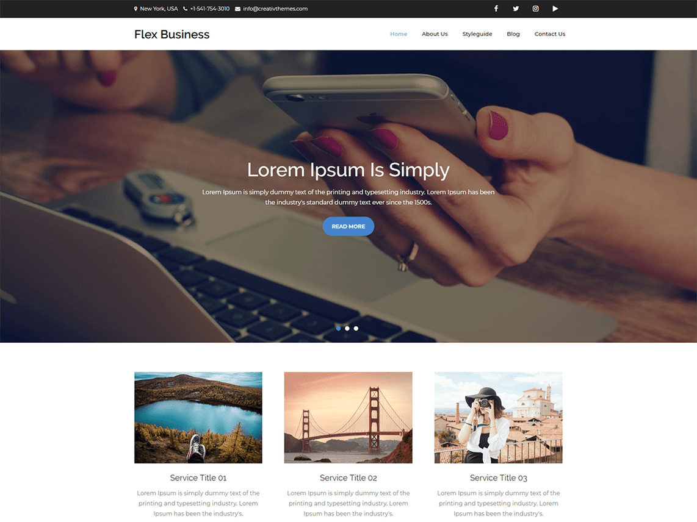

# Learn Webdesign
Do you have a busy work or life schedule? Will you like to learn web development by taking up daiy or weekly tasks or challenges? Then this curriculum is for you.

## Situation
Techsavvy Limited needs your help. They just took up a web design project for a very important client, their front-end developer is down with a cold and is currently tweeting from the hospital bed.

They would like you hop on board by replacing the developer. They know you don't have much experience with coding and will do their best in providing the best resources you need to work on your tasks. 

You will work as the front end developer on the project until the front end guy recovers fully and comes back to work. (That is if the front end guy still has his job when he gets back) Let's work towards ensuring he doesn't.

Let's have a look at the project

## Project
Client X just opened a new line of male and female shoes called Grande.
They want an E-commerce website for project Grande.
They would like the home page to look like this:

